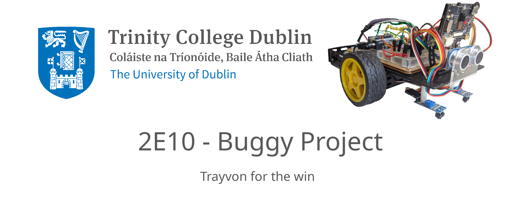

# 2E10 - Buggy
### A Trinity College Dublin Engineering project

## Authors

- [@Cristina](https://www.github.com/alpha-num1)
- [@Conor](https://www.github.com/)
- [@halbachj](https://www.github.com/halbachj)

# 2E10 Buggy
### Built by Cristina Franco Ortuno, Conor Quinn, Johannes Halbach

This repository is part of the Project for the 2E10 module in Trinity College Dublin Engineering. Goal was to build the electronics and software for a small buggy. This repository contains both the code for the Buggy and the ground station.
## Documentation

[Documentation](https://halbachj.github.io/2E10-Buggy)

